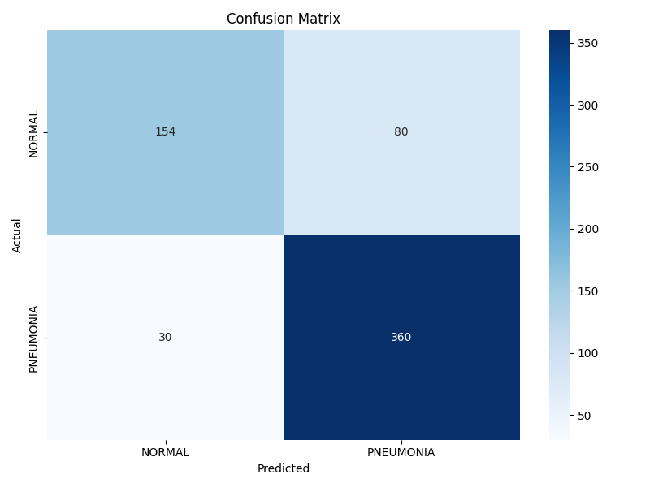
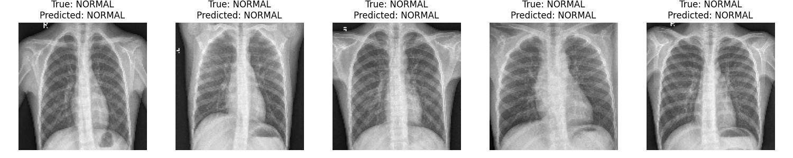
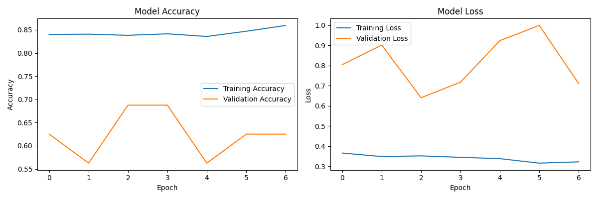

# Chest X-Ray Pneumonia Classification 🩺🦠

This project was completed during the AI BootCamp at BeCode in Ghent.  
Check out the [BeCode website](https://www.becode.org) for more information.  

# Check the Model and Application Online 🌐  

You can test the pneumonia classification model from X-ray images and the Streamlit application online by clicking the link below:  
[Streamlit App](https://pneumonia-classification-on-x-rays-imb.streamlit.app/)

## Project Overview 💡
A project for classifying chest X-ray images as either normal or showing signs of pneumonia using a fine-tuned VGG19 model.   
This project implements a binary classification system for chest X-ray images using transfer learning with the VGG19 architecture.  
The system is designed to assist in the identification of pneumonia cases from chest X-ray images.  


## Dataset 📚

The dataset used in this project is the Chest X-Ray Images (Pneumonia) dataset from Kaggle, available at: 
[Kaggle](https://www.kaggle.com/datasets/paultimothymooney/chest-xray-pneumonia)

Please download the dataset before running the code. The dataset consists of chest X-ray images categorized into two classes:

- Normal: Healthy chest X-rays 
- Pneumonia: X-rays showing signs of pneumonia infection 

## Model Weights ⚙️

The model weights will be generated after running the training code. They are not included in the repository and will be created during the execution of the code.  
The only model weight file included in the repository is `vgg19_best.h5.`


## Features 🚀

- Transfer learning using VGG19 architecture
- Data augmentation for improved model robustness
- Multiple training variants with different fine-tuning strategies
- Comprehensive visualization tools for model evaluation 
- Support for model performance analysis and visualization 

## Project Structure 📁

```

├── model_weights/
│   ├── vgg19_model_01.h5
│   ├── vgg19_model_02.h5
│   ├── vgg19_model_03.h5
│   └── vgg19_best.h5
│   └── vgg19_model_01_history.json
│   └── vgg19_model_02_history.json
└── src/
│   └── main.py
│   └── streamlit_app.py
│   └── train.py
│   └── visualize.py
├── visuals/
│   └── classification_report.txt
│   └── confusion_matrix.png
│   └── sample_predictions.png
│   └── traning_history.png
├── classification_report.txt
├── README.md
├── requirements.txt
├── streamlit_demo.gif
```

## Requirements 📜

- Python 3.x
- TensorFlow 2.x
- OpenCV (cv2)
- NumPy
- Matplotlib
- Seaborn
- scikit-learn
- Streamlit 

## Design Decisions and Methodology 🤖

1. **Choice of VGG19**: 
   - VGG19 was selected for its proven track record in medical image analysis 
   - The pre-trained ImageNet weights provide valuable low-level feature extraction capabilities 
   - The architecture's depth is well-suited for detecting complex patterns in X-ray images

2. **Data Augmentation Strategy**:
   - Implemented rotation, flipping, and shifting to simulate real-world variation in X-ray positioning 
   - Helps prevent overfitting by increasing the effective dataset size
   - Augmentation parameters were chosen to reflect realistic X-ray image variations

3. **Transfer Learning Approach**:
   - Initial training with frozen layers to preserve ImageNet feature extractors
   - Gradual unfreezing of later layers to fine-tune for X-ray specific features
   - Multiple training stages to optimize model performance

4. **Training Pipeline Design**:
   - Early stopping to prevent overfitting
   - Learning rate reduction on plateau for optimal convergence
   - Model checkpointing to save best performing versions
   - Batch size optimization for memory efficiency

## Model Architecture 🧠

The model uses VGG19 as the base architecture with the following modifications:
- Pre-trained ImageNet weights
- Custom top layers:
  - Flatten layer
  - Dense layer (4608 units, ReLU activation)
  - Dropout layer (0.2)
  - Dense layer (1152 units, ReLU activation)
  - Output layer (2 units, Softmax activation)

## Training 🏋️‍♂️

The training process includes three main variants:

1. Initial training (vgg19_model_01):
   - All VGG19 layers frozen
   - 20 epochs
   - Base learning rate

2. Fine-tuned model (vgg19_model_02):
   - Last two convolutional layers unfrozen
   - 10 epochs
   - Trained from vgg19_model_01 weights

3. Alternative training (vgg19_model_03):
   - Different training parameters
   - 5 epochs with increased steps per epoch
   - Trained from vgg19_model_01 weights

### Training Features 🎯

- Data augmentation (rotation, flips, shifts)
- Early stopping
- Learning rate reduction on plateau
- Model checkpointing

## Model Performance 📈

### Model Architecture Analysis
The VGG19-based model architecture shows both strengths and areas for improvement:

1. **Transfer Learning Effectiveness**:
   - Successfully leverages pre-trained ImageNet features
   - Custom top layers effectively adapt to X-ray specific features
   - Dropout layers help control overfitting, though some still occurs

2. **Classification Performance**:
   - Strong pneumonia detection (377 correct out of 390 cases, 96.7% sensitivity)
   - Good normal case identification (142 correct out of 234 cases, 60.7% specificity)
   - Overall accuracy of approximately 83%

3. **Learning Behavior**:
   - Training accuracy reaches 85%, showing good pattern recognition
   - Validation accuracy fluctuation (55-75%) indicates some instability
   - Gap between training and validation metrics suggests overfitting

### Areas of Concern 🚨

1. **False Positives**:
   - 92 normal cases misclassified as pneumonia
   - May lead to unnecessary follow-up in clinical settings
   - Suggests need for better feature discrimination

2. **False Negatives**:
   - 13 pneumonia cases missed
   - More critical from a clinical perspective
   - Lower than false positives, which is preferable for medical screening

3. **Model Stability**:
   - Validation accuracy fluctuation indicates potential instability
   - Learning rate adjustments may be needed
   - Could benefit from more robust regularization

### Performance Metrics 📊
```
Classification Report:
              precision    recall  f1-score   support
     Normal       0.92      0.61      0.73       234
  Pneumonia       0.80      0.97      0.88       390
```

These metrics indicate that the model:
- Is more confident in pneumonia detection
- Shows some hesitation with normal case classification
- Maintains high sensitivity for disease detection
- Could benefit from improvements in specificity

#### Confusion Matrix 🧩

The confusion matrix provides insights into the classification performance of the model.




#### Sample Predictions 👀

The following sample predictions illustrate the model's ability to distinguish between normal and pneumonia cases.



#### Training History 📉
 
The training history chart displays the accuracy and loss trends during training.



### Running the Project 🚀

To run the application, use the main.py script, which integrates model loading, prediction, and visualization in one pipeline.

```
python src/main.py --model model_weights/vgg19_best.h5 --data chest_xrays/chest_xray
```

Streamlit App 🌐

Alternatively, you can run the Streamlit app for an interactive interface to make predictions on X-ray images:
```
streamlit run src/streamlit_app.py
```
This will launch a web-based interface where you can upload an image and get real-time predictions from the trained model!


## Future Improvements 🔮

1. Implement cross-validation for more robust evaluation
2. Explore additional data augmentation techniques
3. Test different architectures (ResNet, EfficientNet)
4. Add gradient-weighted class activation mapping (Grad-CAM)
5. Implement ensemble methods for improved accuracy


## Acknowledgments 🙏
 
- VGG19 architecture and ImageNet weights provided by TensorFlow/Keras
